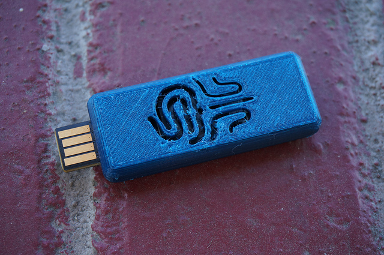

# USB-armory-case
A 3D printed case for Inverse Path's USB armory

These are 3D printable files in STL and OBJ format for making your own case for Inverse Path's [USB armory](http://inversepath.com/usbarmory.html) device.

The format with a "logo" includes a Chinese seal associated with a Chinese name of mine. This provides airflow for the CPU. An editable version of this can [be found on Tinkercad](https://www.tinkercad.com/things/fDo2lkZYljE-usb-armory-case-round-edge-logo).

There is a plain version without a logo with holes added to permit airflow. An editable version of this can [be found on Tinkercad](https://www.tinkercad.com/things/0hIxW1r2U5h-usb-armory-case-round-edge).

 